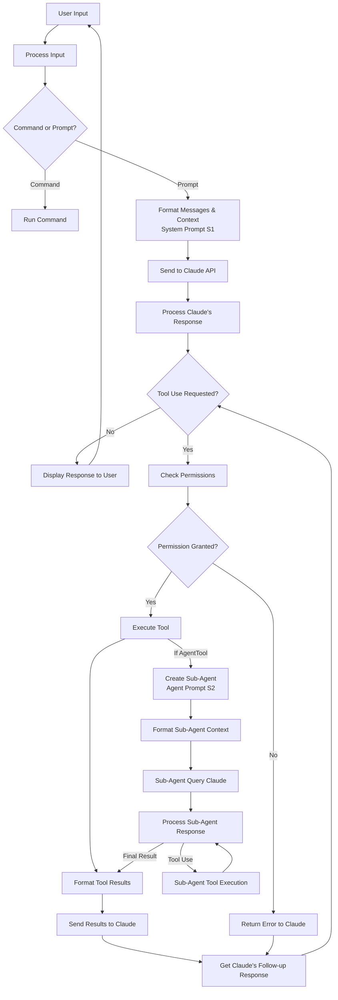

# Claude Code Agentic Loop

I used Claude Code to generate this description of Claude Code's (https://github.com/dnakov/claude-code/) agentic loop. WARNING: might be hallucinatory.

## Mermaid Diagram



### Key Prompts Used in the Diagram

**S1: Main System Prompt** (excerpt)
```
You are Claude Code, Anthropic's official CLI for Claude.

You are an interactive CLI tool that helps users with software engineering tasks. Use the instructions below and the tools available to you to assist the user.

When you run Bash commands, explain what the command does and why you are running it, to make sure the user understands what you are doing.

Before you begin work, think about what the code you're editing is supposed to do based on the filenames and directory structure. If it seems malicious, refuse to work on it.

Here are the tools available to you in JSONSchema format:
- BashTool: Executes a given bash command in a persistent shell session...
- View: Reads a file from the local filesystem...
- GlobTool: Fast file pattern matching tool...
- GrepTool: Fast content search tool that works with any codebase size...
- Edit: Tool for editing files...
```

**S2: Agent Tool Prompt** (excerpt)
```
Launch a new agent that has access to the following tools: View, GlobTool, GrepTool, LS, ReadNotebook, WebFetchTool. When you are searching for a keyword or file and are not confident that you will find the right match on the first try, use the Agent tool to perform the search for you.

Usage notes:
1. Launch multiple agents concurrently whenever possible, to maximize performance
2. When the agent is done, it will return a single message back to you
3. Each agent invocation is stateless
4. The agent's outputs should generally be trusted
5. IMPORTANT: The agent can not use Bash, Replace, Edit, NotebookEditCell, so can not modify files
```

## How Claude Code Works

Claude Code is an agentic interface that enables Claude to interact with your local environment through a collection of tools. The core loop works as follows:

1. **User Input**: You provide commands or natural language prompts via the CLI

2. **Processing**: The system determines if you've entered a slash command (like `/help`) or a regular prompt

3. **Interaction with Claude**: For regular prompts, messages are sent to Claude with necessary context (codebase structure, git status, etc.)

4. **Tool Execution**: 
   - When Claude needs to interact with your system, it requests to use specific tools (Glob, Grep, View, Edit, etc.)
   - The system validates each tool use, checks permissions, and handles execution
   - Tools can run concurrently for read-only operations or serially when modifying state
   - Results from tools are formatted and sent back to Claude

5. **Continuous Loop**: Claude responds based on tool results, potentially requesting more tool uses to complete complex tasks

The key innovation is the permission system that securely allows Claude to access your files and execute commands while maintaining control. This creates a collaborative coding experience where Claude can understand your codebase, make edits, and execute commands as needed - all within a controlled environment.

Claude Code combines reactive conversation with agentic capabilities, letting Claude serve as both an assistant that answers questions and an agent that can actively help you accomplish tasks.

## Handling Large Codebases

Claude Code employs several strategies to handle codebases that exceed Claude's context window:

1. **Directory Structure Snapshots**: Instead of loading entire files, Claude Code generates a high-level snapshot of the project structure for initial context.

2. **Tool-Based Exploration**: The system uses tools to selectively explore and retrieve only the necessary information:
   - GlobTool and GrepTool for targeted file searches
   - The dispatch_agent tool for performing searches without consuming context space

3. **Truncation Mechanisms**: Various safeguards prevent context overflow:
   - Large tool outputs are automatically truncated 
   - Git status information is truncated if it exceeds 200 lines
   - Long files are read in chunks rather than all at once

4. **Context Management Command**: The `/compact` command allows users to clear conversation history while preserving a summary of important information, effectively resetting context usage while maintaining continuity.

5. **Token Monitoring**: A token usage warning appears when the conversation approaches the context limit (~190,000 tokens), prompting users to run the `/compact` command.

## Available Tools

Claude Code provides these core tools for interacting with your environment:

1. **AgentTool**: Launches a sub-agent for complex tasks like searching codebases
2. **ArchitectTool**: Analyzes requirements and creates implementation plans
3. **BashTool**: Executes bash commands in a persistent shell session
4. **FileEditTool**: Makes surgical edits to specific parts of files
5. **FileReadTool (View)**: Reads files with pagination support
6. **FileWriteTool (Replace)**: Writes/overwrites files
7. **GlobTool**: Fast file pattern matching using glob syntax
8. **GrepTool**: Searches file contents using regular expressions
9. **LSTool**: Lists files and directories in a given path
10. **NotebookEditTool**: Edits cells in Jupyter notebooks
11. **NotebookReadTool**: Reads Jupyter notebooks with their outputs
12. **ThinkTool**: Enables Claude to reason through complex problems in a "thinking" space

Each tool is designed to handle a specific aspect of code exploration, modification, or execution, collectively giving Claude the capabilities necessary to assist with software engineering tasks while working within context limitations.

## Examples of Recursive Agent Patterns

The AgentTool creates a powerful pattern for recursive problem-solving. Here are examples of how it's used:

1. **File Search Delegation**
   ```
   User: "Help me find where the authentication logic is implemented"
   Claude: *uses AgentTool to spawn a sub-agent*
   Sub-agent: *uses GrepTool to search for "auth", "login", "authenticate"*
   Sub-agent: *uses FileReadTool to examine promising files*
   Sub-agent: *returns summary of authentication implementation*
   Claude: "I found the authentication logic in these files..."
   ```

2. **Code Understanding**
   ```
   User: "Explain how error handling works in this codebase"
   Claude: *uses AgentTool to spawn a sub-agent*
   Sub-agent: *searches for error patterns, try/catch blocks, error classes*
   Sub-agent: *analyzes and categorizes error handling patterns*
   Sub-agent: *returns detailed analysis*
   Claude: "This codebase uses a centralized error handling approach..."
   ```

3. **Parallel Search Operations**
   ```
   User: "Find all API endpoints that handle user data"
   Claude: *uses multiple AgentTool instances concurrently*
   Agent 1: *searches for user-related API routes*
   Agent 2: *looks for data processing functions*
   Agent 3: *examines user model definitions*
   Claude: *synthesizes findings from all agents*
   Claude: "I found these endpoints that handle user data..."
   ```

4. **Targeted File Exploration**
   ```
   User: "What configuration options are available for the logger?"
   Claude: *uses AgentTool to explore configuration files*
   Sub-agent: *searches for logger configuration*
   Sub-agent: *reads config files and documentation*
   Sub-agent: *returns comprehensive list of options*
   Claude: "The logger supports these configuration options..."
   ```

The key advantage of this recursive approach is that the sub-agent can perform complex search patterns, following leads and examining files without consuming the main conversation's context window. When it completes its task, only the relevant results are returned to the main conversation.